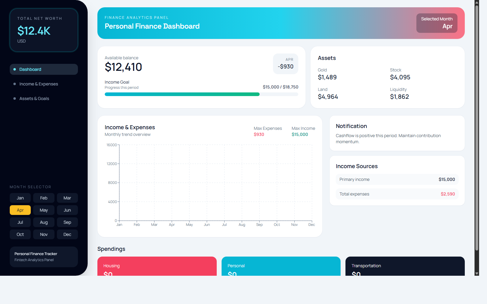
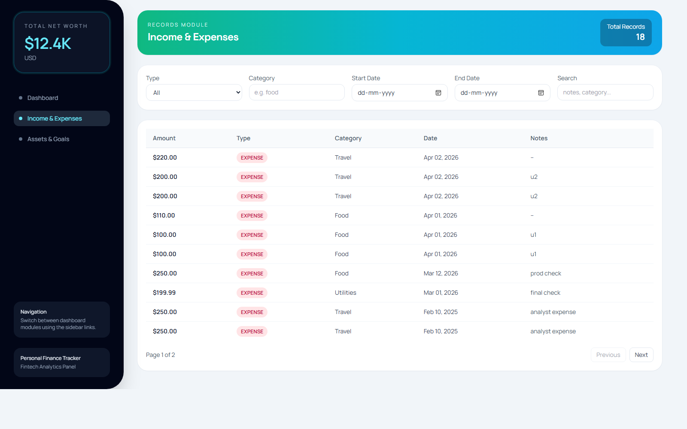
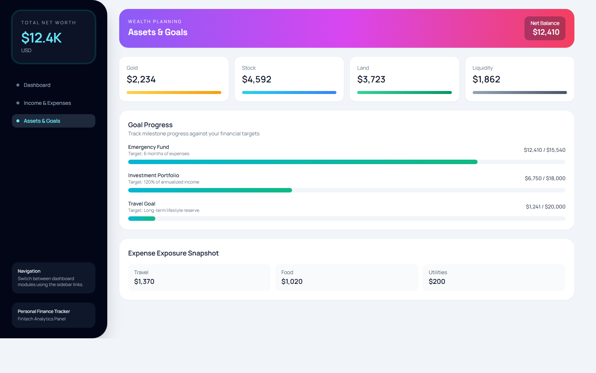

# 💰 Finance Data Processing & Access Control System

<div align="center">


### 🚀 [Live Demo](https://finance-data-processing-and-access-pied-one.vercel.app)

### 🔗 [Backend API](https://finance-data-processing-and-access-ow1l.onrender.com)

*A secure, scalable financial data processing platform with role-based access control, real-time analytics, and production-ready architecture.*

</div>

---

## 🌟 Overview

This project is a **full-stack finance data management system** designed to handle sensitive financial information with **secure role-based access control (RBAC)**.

It enables users to:

- Process and manage financial data
- Visualize analytics through dashboards
- Control access based on user roles (Admin, Analyst, Viewer)

---

## ✨ Key Features

### 🔐 Role-Based Access Control (RBAC)

- Admin: Full access (CRUD operations)
- Analyst: Data processing + analytics
- Viewer: Read-only dashboard access

### 📊 Data Processing & Analytics

- Financial dataset handling
- Real-time dashboard visualization
- Dynamic graph updates

### ⚡ Scalable Backend Architecture

- RESTful API with Express.js
- Modular structure (controllers, services, routes)
- MongoDB for persistent storage

### 🎨 Modern Frontend

- Built with React + Vite
- Responsive UI with clean dashboard design
- API-integrated dynamic data rendering

---

## 🛠️ Tech Stack

### Frontend

- React (Vite)
- Axios (API calls)
- Tailwind CSS

### Backend

- Node.js
- Express.js
- MongoDB (Mongoose)

### Deployment

- Frontend: Vercel
- Backend: Render

---

## 📁 Project Structure

```text
Finance-Data-Processing-and-Access-Control-/
├── finance-backend/
│   ├── src/
│   │   ├── controllers/
│   │   ├── services/
│   │   ├── routes/
│   │   ├── middleware/
│   │   ├── models/
│   │   └── validation/
│
├── finance-frontend/
│   ├── src/
│   │   ├── components/
│   │   ├── pages/
│   │   └── services/
│
├── postman/
├── docs/
```

---

## 🚀 Getting Started

### 1. Clone Repository

```bash
git clone https://github.com/JaiprakashSahu/Finance-Data-Processing-and-Access-Control-.git
cd Finance-Data-Processing-and-Access-Control-
```

---

### 2. Backend Setup

```bash
cd finance-backend
npm install
npm start
```

Create `.env`:

```env
MONGO_URI=your_mongodb_uri
JWT_SECRET=your_secret
PORT=3000
```

---

### 3. Frontend Setup

```bash
cd finance-frontend
npm install
npm run dev
```

Create `.env`:

```env
VITE_API_URL=http://localhost:3000
```

---

## 🌐 Deployment

### Frontend (Vercel)

- Root Directory: `finance-frontend`
- Build: `vite build`
- Output: `dist`

### Backend (Render)

- Root Directory: `finance-backend`
- Start: `node src/server.js`

---

## 📡 API Documentation

Postman Collection available in:

```text
/postman/Finance-Dashboard.postman_collection.json
```

---

## 📊 Core Functional Flow

1. User logs in
2. Role is assigned (Admin / Analyst / Viewer)
3. API validates permissions
4. Data is processed and stored
5. Dashboard displays real-time insights

---

## 🔧 Key Highlights

- Clean modular backend architecture
- Secure authentication & authorization
- Production deployment (Vercel + Render)
- Scalable API design
- Real-world finance use case

---

## 📸 Screenshots

### Dashboard


### Income & Expenses


### Assets & Goals


---

## 🤝 Contributing

Feel free to fork the repo and submit pull requests.

---

## 📝 License

MIT License

---

<div align="center">

**Built with ❤️ using MERN Stack & modern web technologies**

</div>
